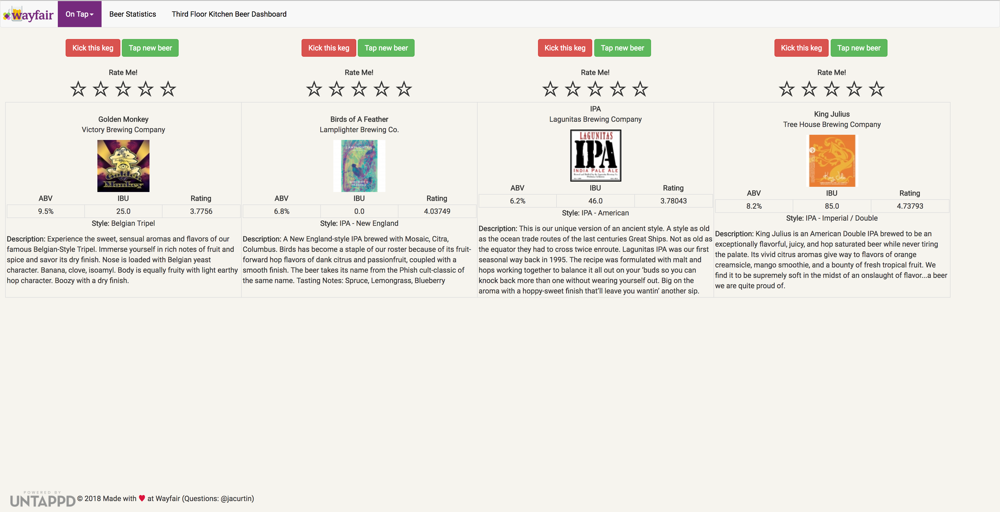

# wayfair_beer

Dashboard and analytics for the beers Wayfair keeps on tap



## [#WayfairHacks18](https://wayfairhacks18.devpost.com/)
[Pitch Deck](https://docs.google.com/presentation/d/1fWbTpUF-U3MhZRMSCmPBKTp3q1zZtFAq-Psef3XrU0U/edit?usp=sharing) *Note*: Only accessible on the Wayfair network

## Dev Setup
Make sure you have Docker and `docker-compose` (version 3.6+) installed.
To build the necessary images:
```
docker-compose build
```
To start the app:
```
docker-compose up -d
```
The first time you run, you will need to initialize a database and can optionally seed it with data.
```
docker exec <<DASHBOARD_CONTAINER_NAME>> python manage.py create-schema
docker exec <<DASHBOARD_CONTAINER_NAME>> python manage.py seed-data
```
Head over to `localhost:5000` to see the site live!

Interested to see the logs? Try running:
```
docker logs -t -f <<CONTAINER_NAME>>
```

## Migrations
Migrations are handled via alembic. To create a new migration, run:
```
docker exec <<DASHBOARD_CONTAINER_NAME>> alembic revision -m "<<MIGRATION DESCRIPTION>>"
```
Edit the newly created file with the appropriate up and down revisions. To apply the migrations, run:
```
docker exec <<DASHBOARD_CONTAINER_NAME>> alembic upgrade head
```
